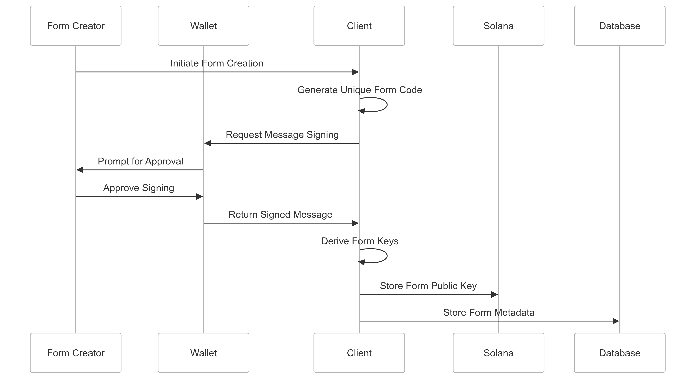
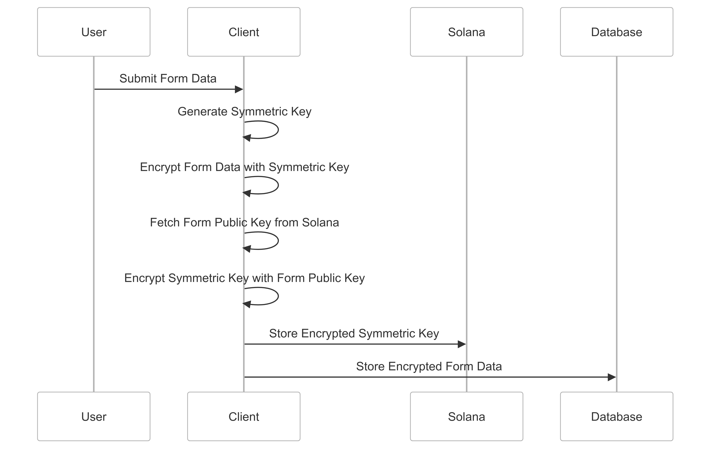
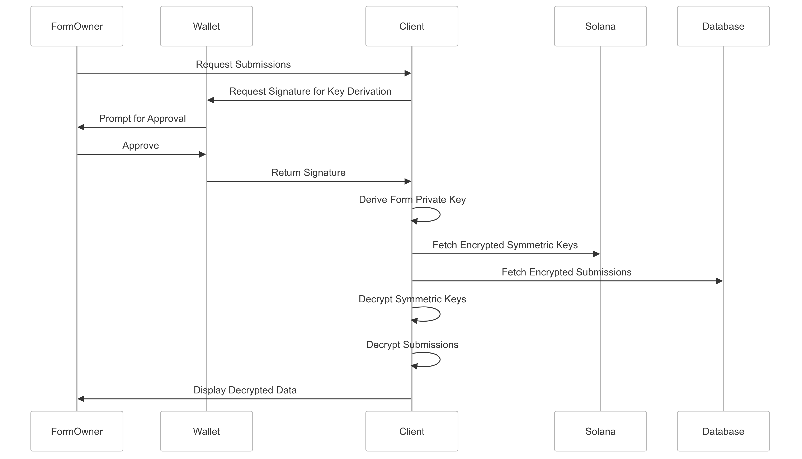

[Formana](https://formana.olich.me/) is a platform for creating, managing, and verifying forms, powered by Solana blockchain technology, where each form submission is encrypted client-side and securely stored. 

[Formana](https://formana.olich.me/) platform conssits of two parts: 
- A private **dashboard** for form creators: where users ca create, edit, publish forms and view submissions.
- A public **form url** shared with form submitters: where users submit responses to the form.

[Formana](https://formana.olich.me/) employs a sophisticated hybrid encryption system to secure form submissions. This system combines asymmetric (public-key) and symmetric encryption to provide both security and efficiency, while integrating with the Solana blockchain for enhanced integrity and transparency.

## Key Generation and Management

### Form Creation Process
When a new form is created, a unique public-private key pair is generated for that form.


### Form Private Key Derivation Process
The form's private key is never directly stored. Instead, it's derived when needed using a deterministic process. This approach enhances security by eliminating the risk of stored private keys being compromised.

Detailed steps:

1. **Unique Message Creation**:
    
    ```jsx
    const message = new TextEncoder().encode(`FORM_ENCRYPTION_KEY_${form.code}`);
    
    ```
    
2. **Message Signing**:
    
    ```jsx
    const signature = await signMessage(message);
    
    ```
    
3. **Seed Generation**:
    
    ```jsx
    const seed = nacl.hash(signature).slice(0, 32);
    
    ```
    
4. **Key Pair Generation**:
    
    ```jsx
    const formKeyPair = nacl.box.keyPair.fromSecretKey(seed);
    
    ```
    
5. **Public Key Storage**:
The public key is stored on the Solana blockchain:
    
    ```jsx
    CREATE_FORM_INSTRUCTION_LAYOUT.encode(
      {
        variant: 0,
        code: form.code,
        schema_url: `${window.location.origin}/api/${form.code}/schema`,
        encryption_key: Buffer.from(formPublicEncryptionKey)
      },
      buffer
    );
    
    ```
    

### Security Implications

- The private key is never stored, reducing the risk of key compromise.
- Deriving the private key requires both the form code and access to the creator's wallet.
- The derivation process must be repeated each time decryption is needed, ensuring continued control.

## Form Submission and Encryption
When a user submits a form, the data is encrypted before being stored.


Encryption Process:

1. **Symmetric Key Generation**:
    
    ```jsx
    const symmetricKey = nacl.randomBytes(nacl.secretbox.keyLength);
    
    ```
    
2. **Form Data Encryption**:
    
    ```jsx
    const encryptedContent = encryptFormData(formValues.current, symmetricKey);
    
    ```
    
3. **Symmetric Key Encryption**:
    
    ```jsx
    const encryptedSymmetricKey = nacl.box(
      symmetricKey,
      nonce,
      formPublicKey.toBuffer(),
      nacl.box.keyPair().secretKey
    );
    
    ```
    
4. **Data Storage**:
    - Encrypted form data is stored in the database.
    - Encrypted symmetric key is stored on the Solana blockchain.
  
## Solana Integration
The Solana blockchain is used to store critical information and ensure the integrity of the submission process.

### Form Creation on Solana

```jsx
const instruction = new TransactionInstruction({
  keys: [
    { pubkey: publicKey, isSigner: true, isWritable: false },
    { pubkey: formAccount, isSigner: false, isWritable: true },
    { pubkey: SystemProgram.programId, isSigner: false, isWritable: false },
    { pubkey: payerKeypair.publicKey, isSigner: true, isWritable: true }
  ],
  data: instructionBuffer,
  programId: new PublicKey(PROGRAM_ID)
});

```

This transaction:

- Creates a Program Derived Address (PDA) for the form
- Stores the form's public key
- Associates the form with its creator's wallet address

### Submission Storage on Solana

```jsx
const instruction = new TransactionInstruction({
  keys: [
    { pubkey: publicKey, isSigner: true, isWritable: false },
    { pubkey: formAccount, isSigner: false, isWritable: true },
    { pubkey: submissionAccount, isSigner: false, isWritable: true },
    { pubkey: SystemProgram.programId, isSigner: false, isWritable: false },
    { pubkey: payerKeypair.publicKey, isSigner: true, isWritable: true }
  ],
  data: instructionBuffer,
  programId: new PublicKey(PROGRAM_ID)
});

```

This transaction:

- Creates a PDA for the submission
- Stores the encrypted symmetric key
- Links the submission to the form and the submitter's wallet address

## Decryption Process (for form owners)
To decrypt submissions:

1. The form owner re-derives the form's private key using their wallet.
2. They fetch the encrypted symmetric key from Solana.
3. They decrypt the symmetric key using the form's private key.
4. They use the decrypted symmetric key to decrypt the form data.

## Security Considerations

1. **Key Management**: The form's private key is never stored, significantly reducing the risk of key compromise.
2. **Per-Submission Encryption**: Each submission uses a unique symmetric key, limiting the impact of potential breaches.
3. **Blockchain Integration**: Solana ensures transparency and prevents tampering with submission records.
4. **Wallet Integration**: Tying the form key derivation to the creator's wallet adds an additional layer of security.

## Conclusion

By implementing this hybrid encryption system and leveraging Solana's blockchain, Formana provides a secure, efficient, and transparent way to handle sensitive form submissions. The combination of asymmetric and symmetric encryption, along with the decentralized nature of blockchain storage, ensures that form data remains confidential and tamper-proof, while still allowing authorized access by form owners.

> Read more about formana or try it out by visting the website: https://formana.olich.me or exporing GitHub repo: https://github.com/olich97/formana-blockchain.