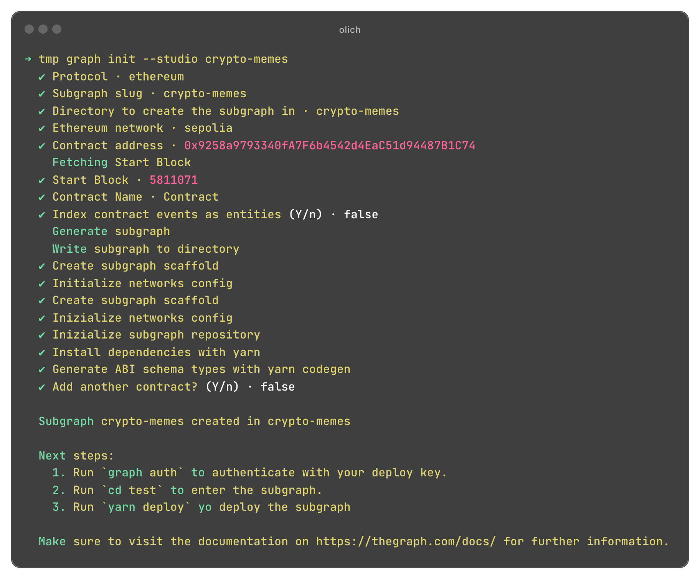
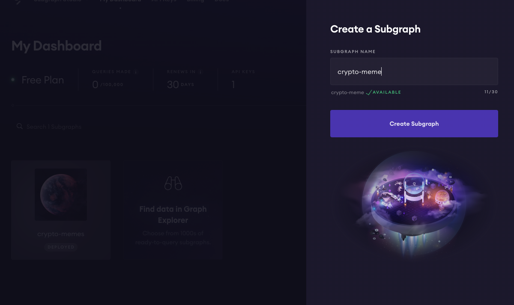
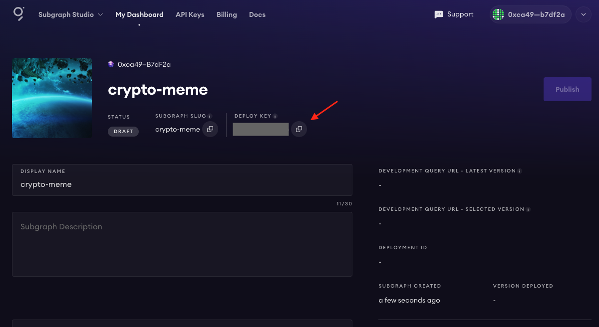
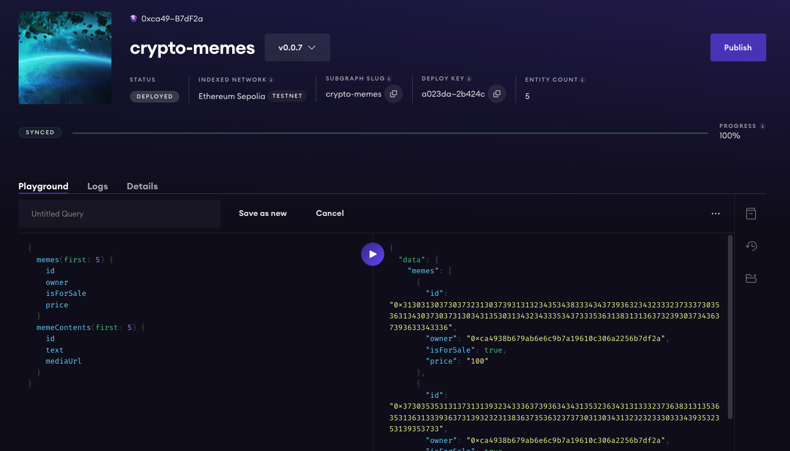

In the evolving world of blockchain technology, efficiently managing and querying data from smart contracts is crucial for the success of decentralized applications (dApps). The Graph Protocol offers a powerful solution by enabling developers to create and use open APIs, called subgraphs, to index blockchain data. In this guide, we'll explore how you can use The Graph Protocol to index and query ERC1155 token data and its IPFS content, enhancing the dApp's functionality and user experience.


## Prerequisites

- [GitHub](https://github.com/)
- [Graph CLI](https://thegraph.com/docs/en/developing/creating-a-subgraph/#install-the-graph-cli)
- [Solidity for Visual Studio Code](https://marketplace.visualstudio.com/items?itemName=JuanBlanco.solidity)
- latest [Solidity](https://docs.soliditylang.org/en/v0.8.23/installing-solidity.html) version
- A smart contract deployed to one of the EVM chains, I will be using my own [CryptoMeme](https://github.com/olich97/crypto-memes/blob/main/blockchain/contracts/CryptoMeme.sol) contract deployed in [Sepolia](https://sepolia.etherscan.io/address/0x9258a9793340fA7F6b4542d4EaC51d94487B1C74)

## What is The Graph Protocol?

[The Graph Protocol](https://thegraph.com/docs/en/about/) is a decentralized protocol for indexing and querying data from blockchains, similar to how web search engines index and query the internet. It allows developers to extract, process, and store data from blockchain transactions and make this data easily accessible through GraphQL APIs. This is particularly useful for dApps that need to perform complex queries that are difficult or inefficient to execute directly on the blockchain. With [The Graph](https://thegraph.com/docs/en/network/overview/), developers can build serverless applications that run entirely on public infrastructure.

## Why Use The Graph for ERC1155 Tokens and IPFS?

[ERC1155](https://ethereum.org/en/developers/docs/standards/tokens/erc-1155/) tokens are unique in that they enable the creation of both fungible (similar to [ERC20](https://ethereum.org/en/developers/docs/standards/tokens/erc-20/)) and non-fungible tokens (similar to [ERC721](https://ethereum.org/en/developers/docs/standards/tokens/erc-721/)) within a single contract. This flexibility can lead to a complex data landscape, making The Graph an ideal tool for handling such diversity efficiently.

[InterPlanetary File System](https://ipfs.tech/) (IPFS) is a protocol and peer-to-peer network for storing and sharing data in a distributed file system. IPFS uses content-addressable storage, meaning files are identified by their content, not their location, which is perfect for decentralization.

Combining ERC1155 tokens with IPFS provides a robust structure for managing digital assets in a decentralized manner, and indexing this information with The Graph makes it readily queryable and linkable within our applications.

> In this case we combining a simple subgraph with [file data sources templates](https://thegraph.com/docs/en/developing/creating-a-subgraph/#file-data-sources) to index both on-chain (CryptoMemes events/transactions) and off-chain (NFT json metadata) data.

## Overview of Smart Contract Events

> I'm using my own ERC1155 example smart contract, complete source code can be found [here...](https://github.com/olich97/crypto-memes/blob/main/blockchain/contracts/CryptoMeme.sol)

The [CryptoMeme.sol](https://github.com/olich97/crypto-memes/blob/main/blockchain/contracts/CryptoMeme.sol) contract outlines several events:

- `MemeCreated`: Triggered when a new meme is created.
- `MemePurchased`: Emitted when a meme is purchased.
- `MemePriceChanged`: Fired when the price of a meme is updated.
- `MemeSaleStatusChanged`: Emitted when a meme's sale status changes.
- 
These events carry vital data that describe the state transitions in the lifecycle of a meme "entity" within the platform.

```solidity
    /**
     * @dev Emitted when a new meme is created.
     *
     * @param memeId The newly created meme's token ID.
     * @param owner The owner of newly created meme token.
     * @param isForSale Meme is for sale or not.
     * @param price The starting price for the meme.
     * @param createdAt The unix timestamp when the meme was created.
     * @param contentUri The content URI of the meme.
     */
    event MemeCreated(
        uint256 indexed memeId,
        address indexed owner,
        bool isForSale,
        uint256 price,
        uint256 createdAt,
        string contentUri
    );

    /**
     * @dev Emitted when a meme is purchased.
     * 
     * @param memeId The purchased meme's token ID.
     * @param buyer The buyer of the purchased meme.
     */
    event MemePurchased(uint256 indexed memeId, address indexed buyer);

    /**
     * @dev Emitted when a meme price is changed.
     *
     * @param memeId The meme's token ID.
     * @param newPrice The new price for the meme.
     */
    event MemePriceChanged(uint256 indexed memeId, uint256 newPrice);

    /**
     * @dev Emitted when a meme changes its sale status.
     *
     * @param memeId The meme's token ID.
     * @param isForSale Meme is for sale or not.
     */
    event MemeSaleStatusChanged(uint256 indexed memeId, bool isForSale);
```

## Step 1: Create subgraph

We can create the initial subgraph by running the following command and follow the instructions:
```bash
graph init --studio <SUBGRAPH_SLUG>
```
Here an example output:


With this command we created a scaffold subgraph that we can use as a starting point for building our subgraph.

## Step 2: Modify subgraph mappings and schema

When making changes to the subgraph, we will mainly work with three files:

- Manifest (`subgraph.yaml`): The manifest defines the smart contracts your subgraph indexes, which events from these contracts to pay attention to, and how to map event data to entities that Graph Node stores and allows to query.
- Schema (`schema.graphql`): The GraphQL schema defines what data we wish to retrieve from the subgraph and relations between them. [GraphQL schemas](https://thegraph.com/docs/en/querying/graphql-api/) are defined using the GraphQL interface definition language.
- AssemblyScript Mappings (`crypto-meme.ts`): This is the code that translates data from our datasources to the entities defined in the schema.

Let's start with defining the `schema.graphql`:

```graphql
type Meme @entity {
  id: Bytes! # memeId
  owner: Bytes! # address
  isForSale: Boolean! # bool
  price: BigInt! # uint256
  contentUri: String!
  content: MemeContent
  createdAt: BigInt! # uint256
  updatedAt: BigInt! # uint256
}

type MemeContent @entity {
  id: ID! # contentUri
  text: String!
  mediaUrl: String!
}

type _Schema_
  @fulltext(
    name: "memeSearch"
    language: en
    algorithm: rank
    include: [{ entity: "MemeContent", fields: [{ name: "text" }] }]
  )
```

As you can see we have two entities:

- `Meme`: the entity that rappresent a Meme NFT token and it will be created by `MemeCreated` event and updated by other events (e.g `MemePurchased`). Note that the `content` field is pointing to `MemeContent` as 1:1 relationship.
- `MemeContent`: is the entity to index NFTs metadata related to Meme token, it cointains fields from json file uploaded to IPFS storage.

> We are also defining a text search field on the text of MemeContent. [Read more about full text search field...](https://thegraph.com/docs/en/developing/creating-a-subgraph/#defining-fulltext-search-fields)

Now it's time to update `subgraph.yaml` file like this:
```yml
specVersion: 1.0.0
indexerHints:
  prune: auto
schema:
  file: ./schema.graphql
dataSources:
  - kind: ethereum
    name: CryptoMeme
    network: sepolia
    source:
      address: "0x9258a9793340fA7F6b4542d4EaC51d94487B1C74"
      abi: CryptoMeme
      startBlock: 5811071
    mapping:
      kind: ethereum/events
      apiVersion: 0.0.7
      language: wasm/assemblyscript
      entities:
        - Meme
      abis:
        - name: CryptoMeme
          file: ./abis/CryptoMeme.json
      eventHandlers:
        - event: MemeCreated(indexed uint256,indexed address,bool,uint256,uint256,string)
          handler: handleMemeCreated
        - event: MemePriceChanged(indexed uint256,uint256)
          handler: handleMemePriceChanged
        - event: MemePurchased(indexed uint256,indexed address)
          handler: handleMemePurchased
        - event: MemeSaleStatusChanged(indexed uint256,bool)
          handler: handleMemeSaleStatusChanged
      file: ./src/crypto-meme.ts

templates:
  - name: MemeContent
    kind: file/ipfs
    mapping:
      apiVersion: 0.0.7
      language: wasm/assemblyscript
      file: ./src/crypto-meme.ts
      handler: handleMemeContent
      entities:
        - MemeContent
      abis:
        - name: CryptoMeme
          file: ./abis/CryptoMeme.json

features:
    - fullTextSearch

```

We sucessfully configured two data sources:

- `CryptoMeme`: a data source for tracking/extract ethereum events for CryptoMeme smart contract.
- `MemeContent`: a data source template for reading and extracting IPFS content.

After this, we can move to defining the mappings and how to save/proccess our data in `crypto-meme.ts` file:

```TypeScript

export function handleMemeCreated(event: MemeCreatedEvent): void {
  let entity = new Meme(Bytes.fromUTF8(event.params.memeId.toString()));
  entity.owner = event.params.owner;
  entity.isForSale = event.params.isForSale;
  entity.price = event.params.price;
  entity.createdAt = event.params.createdAt;
  entity.updatedAt = event.block.timestamp;
  entity.contentUri = event.params.contentUri;
  // trigger MemeContent file data template with IPFS hash
  // https://thegraph.com/docs/en/developing/creating-a-subgraph/#file-data-sources
  let ipfsIndex = entity.contentUri.indexOf('/ipfs/');
  let ipfsHash = entity.contentUri.substr(ipfsIndex + 6);
  // map the hash to content field so we can mantain relationship with MemeContent entity
  entity.content = ipfsHash;
  entity.save();
  // we can exit and not trigger the template if the hash is something different than ipfs
  if (ipfsIndex == -1) return;
  // trigger MemeContent file data template (aka handleMemeContent function)
  MemeContentTemplate.create(ipfsHash);
}

export function handleMemePriceChanged(event: MemePriceChangedEvent): void {
  let entity = Meme.load(Bytes.fromUTF8(event.params.memeId.toString()));
  if (entity) {
    entity.price = event.params.newPrice;
    entity.updatedAt = event.block.timestamp;
    entity.save();
  }
}

export function handleMemePurchased(event: MemePurchasedEvent): void {
  let entity = Meme.load(Bytes.fromUTF8(event.params.memeId.toString()));
  if (entity) {
    // change the owner of meme
    entity.owner = event.params.buyer;
    entity.updatedAt = event.block.timestamp;
    entity.save();
    // TODO: additionally we can track the price of this sell
  }
}

export function handleMemeSaleStatusChanged(
  event: MemeSaleStatusChangedEvent
): void {
  let entity = Meme.load(Bytes.fromUTF8(event.params.memeId.toString()));
  if (entity) {
    entity.isForSale = event.params.isForSale;
    entity.updatedAt = event.block.timestamp;
    entity.save();
  }
}

export function handleMemeContent(content: Bytes): void {
  let contentUri = dataSource.stringParam();
  // create a new meme content entity with CID as ID
  let memeContent = new MemeContent(contentUri);
  // read json content of the file
  const value = json.fromBytes(content).toObject();
  if (value) {
    const text = value.get("text");
    const mediaUrl = value.get("mediaUrl");
    if (text && mediaUrl) {
      memeContent.text = text.toString();
      memeContent.mediaUrl = mediaUrl.toString();
    }
    memeContent.save();
  }
}
```

We have four simple handlers:

- `handleMemeCreated`: creates a new `Meme` entity and trigger the IPFS related handler `handleMemeContent`.
- `handleMemePriceChanged`: update the price of an existing `Meme` entity.
- `handleMemePurchased`: update the owner of an existing `Meme` entity.
- `handleMemeSaleStatusChanged`: update the `isForSale` flag of an existing `Meme` entity.
- `handleMemeContent`: read the content of JSON metadata file (based on CID), parse it and store the data in a new `MemeContent` entity related to `Meme` entity.

> You can find more information about File Data Sources in [The Graph Documentation.](https://thegraph.com/docs/en/developing/creating-a-subgraph/#file-data-sources)

## Step 3: Deploy subgraph

Before deploying the subgraph run the folowing commands:
```bash
# to generate models/functions
graph codegen
# to build the entire code
graph build
```

To deploy the subgraph to the network we need: 

1. Connect to [the grapth studio](https://thegraph.com/studio/) with your wallet.
2. Create a new subgraph:

3. Grab the deployment key:

4. Run the folowing command for authentication:
```bash
graph auth --studio <DEPLOY KEY>
```
5. Run the folowing command to actually deploy the subgraph:

```bash
graph deploy --studio <SUBGRAPH_SLUG>
```
> You will be asked for a version label. It's strongly recommended to use semver for versioning like `0.0.1`

After this proccess the subgraph shout start indexing your data and you can view it in the studio and test your data:


> Once your subgraph has been deployed to the Subgraph Studio, you have tested it out, and are ready to put it into production, you can then publish it to the decentralized network. You can folow [this guide](https://thegraph.com/docs/en/quick-start/#7-publish-your-subgraph-to-the-graphs-decentralized-network) to publish it.

## Conclusion

By analyzing smart contract events and translating them into entities within a subgraph, The Graph Protocol enables efficient data queries and enhances the functionality of blockchain applications. This approach not only ensures data is accessible and searchable but also aligns with the decentralized nature of blockchain, making your dApp scalable and performant.

Now you can easily query your blockchain data or integrate them in your dApp UI for providing your users with smooth experience.

Complete source code: 
- [olich97/crypto-memes/subgraph](https://github.com/olich97/crypto-memes/tree/main/subgraph)
- [olich97/crypto-memes/blockchain](https://github.com/olich97/crypto-memes/tree/main/blockchain)

