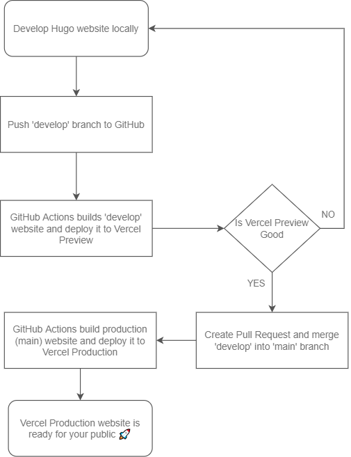
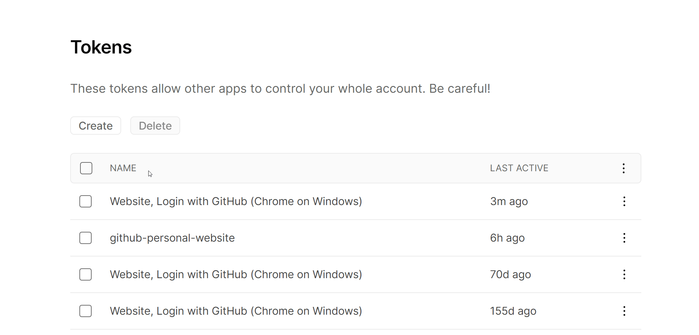
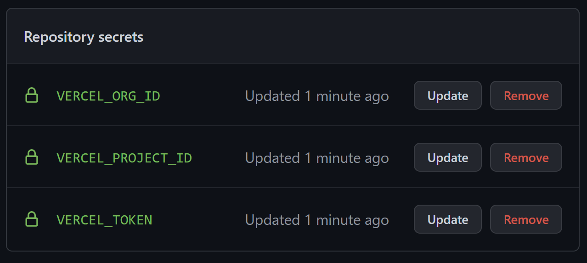
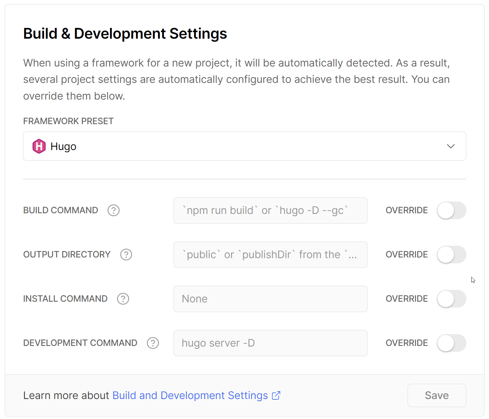
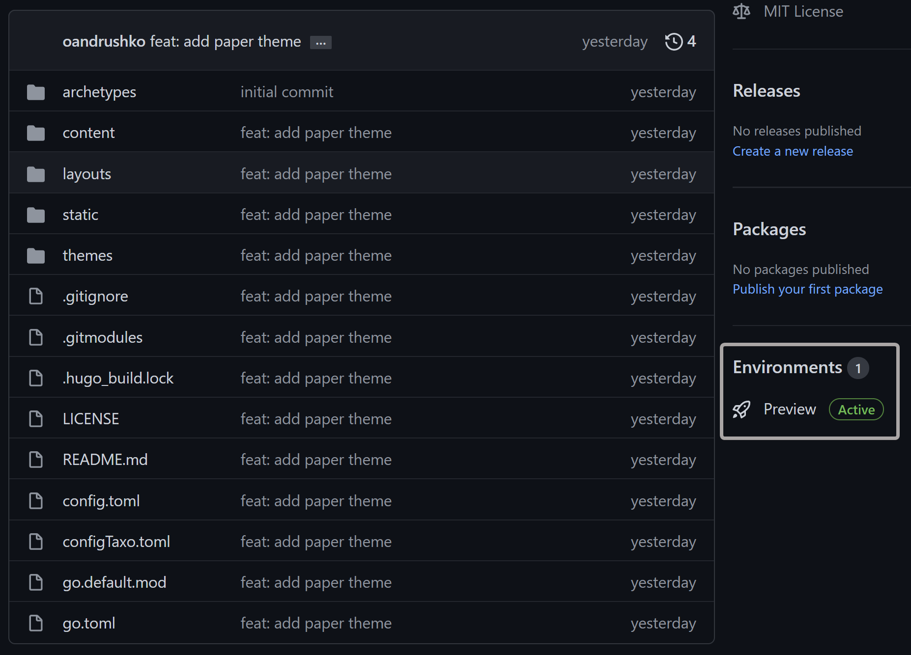
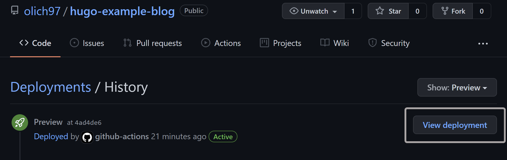
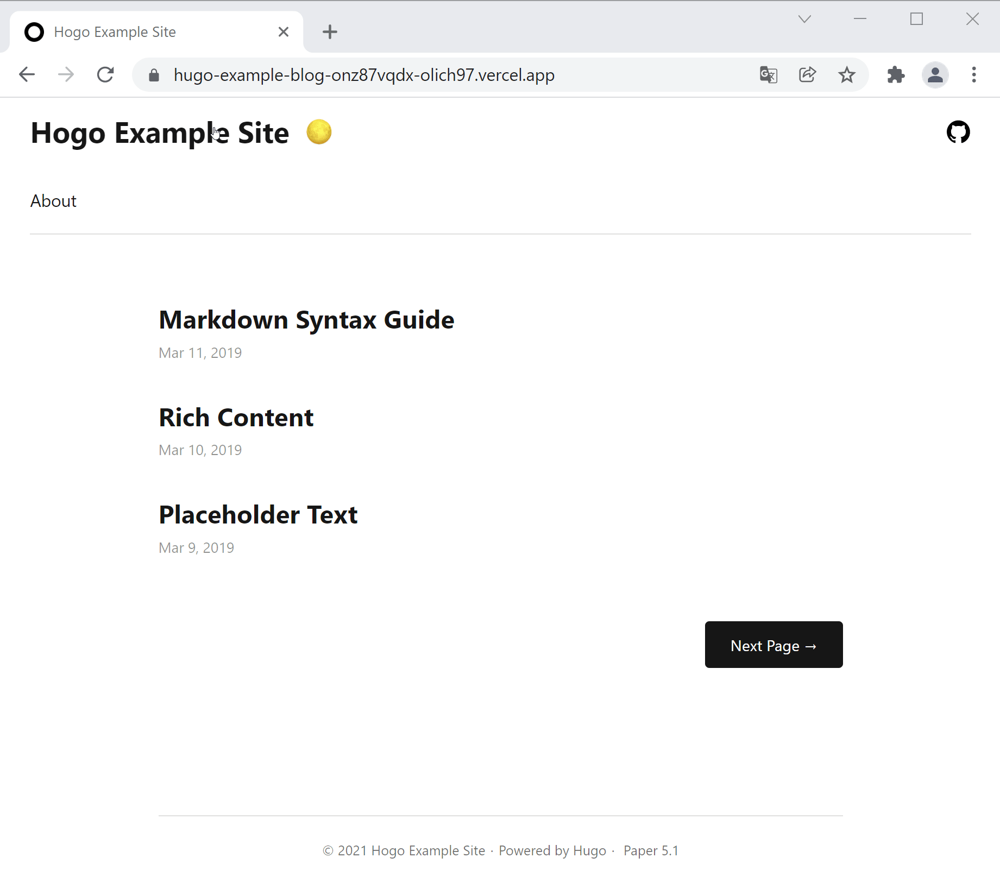
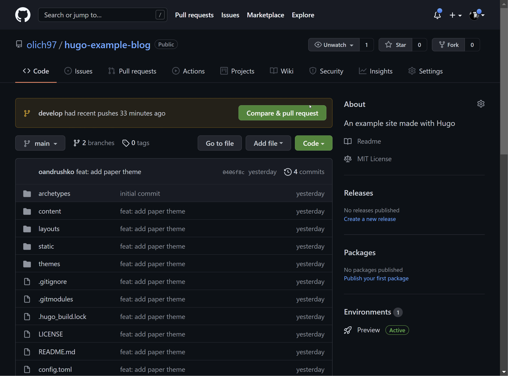
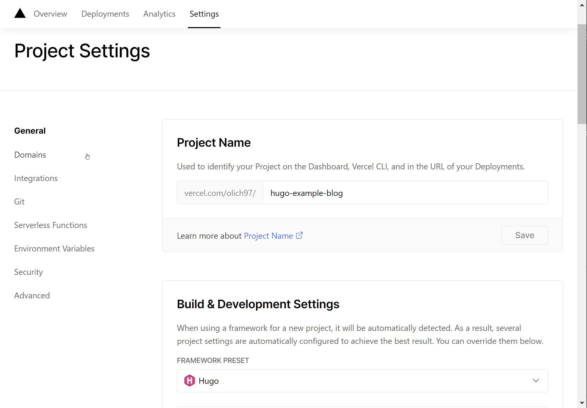

It's been a while that I was wondering what could be a better way to improve my English communication and writing skills? <br>
What about starting a technical blog? <br>
I think in this way I could have fun, keep learning a lot of new stuff and improve my skills by actually practicing it, while building something of my own.<br>

So here I am writing my first blog post on how I actually build this blog 🙂 Let's goooooooooo 💪 <br>
> P.S: Sorry in advance for my rough English

In this post I'll try to explain how to set up a personal site or blog with [Hugo](https://gohugo.io/) for **free**, by creating a [continuous deployment workflow](https://en.wikipedia.org/wiki/Continuous_deployment) with [GitHub Actions](https://github.com/features/actions), deploying and hosting our site on [Vercel](https://vercel.com) platform.

## Why Hugo?

[Hugo](https://gohugo.io/) is a **cross-platform**, **open-source** static site generator written in [Go](https://golang.org/).

> A static site generator is a build tool that produces sites that have pages built beforehand and do not change often between user visits. 
Those pre-rendered pages are hosted where users can access them, a quite different approach unlike dynamic sites we're used to see where a page is built when a user requests it. <br>
Static sites involve a lot fewer moving parts and are easier to build, secure, and maintain. They are fast since pages are already pre-rendered and are served as is. Scaling static sites is easier compared to other sites with more complex infrastructures.

There are a lot of [static sites generators](https://jamstack.org/generators), but here I'll list some of advantages/features that I found quite useful and for which I chose Hugo.

### Fast & Flexible
Hugo is pretty flexible. 

I started this blog with simple open source theme ([there are a lot of them](https://themes.gohugo.io/)), then changed it completely over time. 
Sometimes I want to do things (e.g custom tracking, comments integration) in my website that are out of the scope of a simple blog, and Hugo allows to create those things.

Another reason I chose Hugo is because it is fast. 
First, it has Go at the core, which is known to be a fast compiled language. Also [Go's Goroutines](https://golangbot.com/goroutines/) are a perfect match for many of the tasks that Hugo performs on every build. Things are made to be as fast as possible. 

For example, it comes with [Live Reload](https://gohugo.io/getting-started/usage/#livereload) built in and every time changes are detected it takes milliseconds to see the result:
```shell
Change detected, rebuilding site.
2021-11-09 23:57:27.805 +0100
Source changed "path\\to\\post\\personal-website-with-hugo-and-vercel\\index.md": WRITE
Total in 17 ms
```

### Markdown
I think hugo is a right choice for a technical blog, especially if you are a developer and you’re willing to write in Markdown. Non-tech people might just refuse to use Markdown, and it’s perfectly understandable.

Also, you have to be prepared for a Git-centric workflow for publishing your posts (or you can use some cms solutions like [Strapi](https://strapi.io/integrations/hugo-cms) or [Forestry](https://forestry.io/)). Most people would disagree with me on using `git commit` and `git push` just for publishing a post, but I found it pretty cool.

For example, my process for writing a new post is:

1. Write a post using Markdown
2. Commit my changes to a GitHub develop branch
3. Some glue technology deploys the changes on the Vercel preview server
4. Take some days to review the post in preview environment, make some improvements and then I am satisfied create a pull request towards the main branch
5. After self-accepting the PR, the same glue technology deploys all new stuff on the main server visible to all the world

## Prerequisites

Here are some stuff that you're gonna need in order to make the magic happens:
- [Git](https://git-scm.com/) version control system installed
- [Installation](https://gohugo.io/getting-started/installing/) of Hugo version `0.80.0` or higher
- A free subscription of [Vercel](https://vercel.com/signup) account
- A [GitHub](https://github.com/signup) account

## Step 1: Preparation

First of all, we need to check a correctness of **Git** installation in your system, just by running the `git version` command on your terminal.
You should see something like this on your terminal, as an output:
```bash
git version 2.31.1.windows.1
```
If you don't have git, you can install it by downloading from [the official website](https://git-scm.com/).

> Make sure to connect Git with you GitHub account. Read more about GitHub and Git setup from [here](https://docs.github.com/en/get-started/quickstart/set-up-git).

Now we need to install **Hugo**:

1) Go to [Hugo installation section](https://gohugo.io/getting-started/installing/) of documentation and follow the steps for your operating system

... and create an empty **repository** in your GitHub account:

2) Create a new repository with the name you like (for this tutorial I'll be using `hugo-example-blog`)
> You can create a new repository on GitHub using a web browser or GitHub CLI: check out [the documentation](https://docs.github.com/en/get-started/quickstart/create-a-repo).

3) [Clone](https://docs.github.com/en/repositories/creating-and-managing-repositories/cloning-a-repository) the newly created repository on your computer.

Now, you should be ready to go! 🎉
## Step 2: Create your website

### Creating a new site
Creating a website is pretty easy, just fire the command `hugo new site hugo-example-blog` in a directory of your choice:
```shell
$ hugo new site hugo-example-blog
Congratulations! Your new Hugo site is created in \path\to\hugo-example-blog.
```

Lets add a newly created project [to our GitHub repository](https://docs.github.com/en/github/importing-your-projects-to-github/importing-source-code-to-github/adding-an-existing-project-to-github-using-the-command-line):
1. In the command line, navigate to the newly created directory (/path/to/hugo-example-blog)
2. Initialize the local directory as a Git repository:
```shell
$ git init -b main
Initialized empty Git repository in /path/to/hugo-example-blog/.git/
```
3. Stage and commit all the files in your project:
```shell
$ git add .
$ git commit -m "Initial commit"
```
4. Push all files to GitHub repository:
```shell
# add remote for the repo
$ git remote add origin <REMOTE_URL>
# sets the new remote
$ git remote -v
# for pulling unrelated remote history if there are conflicts
$ git pull origin main --allow-unrelated-histories
# push the changes to remote repository
$ git push origin main
```
### Adding the theme

We need to choose a theme for our website. 
You can do it by choosing the one you like from the [official hugo site](https://themes.gohugo.io/).
Almost all the themes are open source so you can modify them freely.

For this example I've chosen [a paper theme](https://github.com/nanxiaobei/hugo-paper).

Now we need to "install" our theme on newly created website.

There are two ways to do that: 
- Installing a theme as a [Git submodule](https://git-scm.com/book/en/v2/Git-Tools-Submodules): particularly useful when you want to keep your theme updated with new features:
```shell
# navigate to the themes directory inside the site repository
$ cd themes
# add the theme as a submodule
$ git submodule add <THEME_REMOTE_URL>
```
- Manually installing a theme: it's recommended when your are aware of making a lot of custom changes on the theme
```shell
# navigate to the themes directory inside the site repository
$ cd themes
# clone the theme
$ git clone <THEME_REMOTE_URL> <THEME_NAME>
```
If you do not have Git installed:
1. Download the .zip file from GitHub
2. Unzip it to your site's themes directory
3. Rename the directory to the theme name

Here the commands for installing as a submodule our paper theme:
```shell
$ cd themes
$ git submodule add https://github.com/nanxiaobei/hugo-paper.git
```
### Configuring and testing the website
1. Copy a content of `themes/hugo-paper/exampleSite` folder to the root website folder `hugo-example-blog`.
2. Modify `config.toml` file based on your needs
3. Start a website by firing `hugo server` on your terminal inside site folder 
4. Enjoy the result:
`http://localhost:1313`


> You can add a new pages or posts anytime by creating files inside `hugo-example-blog\content` folder

## Step 3: Deploy your website

In this section we will setup a simple [GitHub Actions](https://github.com/features/actions) workflow with `production` (main) and `develop` (develop) branches that will build and deploy our website on Vercel.



> [Vercel](https://vercel.com/docs) is a platform for frontend frameworks and static sites, built to integrate with your headless content, commerce, or database.  It is easy to develop, preview, and ship delightful user experiences, where performance is the default.

### Configuring vercel

In order to deploy our Hugo site from GitHub we need in some way give to GitHub Actions access to our Vercel account.

We're gonna need three essential values from Vercel:
- [Vercel Account Token](https://vercel.com/account/tokens)
- Organization ID
- Project ID

For generation a new **Account Token** just visit https://vercel.com/account/tokens and click on `create', give it a name (in my case 'hugo-example-site') and save it for later use.


To obtain a **Organization ID** and **Project ID** a new project needs to be created. 
For this we’ll use the **Vercel CLI**. 

Use either the `npm` or `yarn` package manager to install the **Vercel CLI** in your local development environment:
```shell
$ npm i -g vercel
```

### Deploying to vercel
Now we create a new project on our vercel account:
1. Login on vercel locally by firing `vercel` command on the root of our project and following instructions: 
```shell
$ vercel
Vercel CLI 23.1.2
No existing credentials found. Please log in:
Log in to Vercel github
Success! GitHub authentication complete for example@email.com
```
2. Now that you’re logged in run the `vercel` command again to configure and deploy our site to Vercel as a new project:
```shell
$ vercel
Vercel CLI 23.1.2
? Set up and deploy “path\to\hugo-example-blog”? [Y/n] y
? Which scope do you want to deploy to? olich97
? Link to existing project? [y/N] n
? What’s your project’s name? hugo-example-blog
? In which directory is your code located? ./
> Upload [===============-----] 72% 1.5sAuto-detected Project Settings (Hugo):
- Build Command: `npm run build` or `hugo -D --gc`
- Output Directory: `public` or `publishDir` from the `config` file
- Development Command: hugo server -D -w -p $PORT
? Want to override the settings? [y/N] n
🔗  Linked to olich97/hugo-example-blog (created .vercel and added it to .gitignore)
🔍  Inspect: https://vercel.com/olich97/hugo-example-blog/ESNvEjydmACDsiibPJt2YCwrYyS9
```

Once deployed search the newly generated local `.vercel` directory for the `project.json` file, it’ll contain your new organisation and project IDs:
```json
{"orgId":"your-secret-organization-id","projectId":"prj_your-secret-project-id"}
```
We need to configure our GitHub site repository with newly created secrets.

Go to GitHub site `repository > Settings > Secrets > Actions > New repository secret`.

Add all three vercel values created:


Since GitHub Actions will be responsible for building Hugo site our new project settings need be updated so that Vercel doesn’t attempt to **build** the site again once GitHub Actions has pushed the content to Vercel.

In the Vercel dashboard navigate to the **Settings** of new project. Click the switch to override the BUILD COMMAND. Leave the input **field empty**:


### Creating the GitHub Actions Workflow Files
First of all we need to create a `develop` branch by running git checkout on the root of our hugo website:
```shell
$ git checkout -b develop
Switched to a new branch 'develop'
```

In a  `.github/workflows` directory at the root of our project create two new files:
- `deploy-preview.yaml` with content: **[preview gist](https://gist.github.com/olich97/a1fb2750a3ca07015ddb8e01685b7b7c)**
- `deploy-production.yaml` with content: **[prod gist](https://gist.github.com/olich97/5ba50f83f008d483ab8215ef09b84d10)**

Let push our changes on GitHub and see what happens.
```shell
$ git add .
$ git commit -m "ci: add GitHub Actions workflow"
$ git push --set-upstream origin develop
```

If we take a look on our GitHub project page we can see that a new environment was created: 


Now we can view our preview deployment just by clicking on **View deployment** link inside GitHub Project deployments page:


As you can see vercel generate a temporary url for our deployment so we can check it:


Now we just have to release everything in production and it is pretty easy: just create and merge a new pull request against `main` branch.



GitHub Actions will build  `main` branch automatically and deploy to vercel production.
Now and it could be navigated from free vercel domain assigned to our website: https://hugo-example-blog.vercel.app. 

The domain can be customized on Vercel Project Settings page: 



## Conclusion

In this article we've created a new static website from zero and configured an automatic deployment workflows for two environments:
- `preview`: for our testing purposes
- `production`: for final users

Another advantage of using a static website (in this case build with Hugo) is pages load time (that is pretty fast in this case). 
You can check [performance of our newly created website](https://gtmetrix.com/reports/hugo-example-blog.vercel.app/Ec70EB41/) on [GTmetrix](https://gtmetrix.com/) and see it by yourself.
