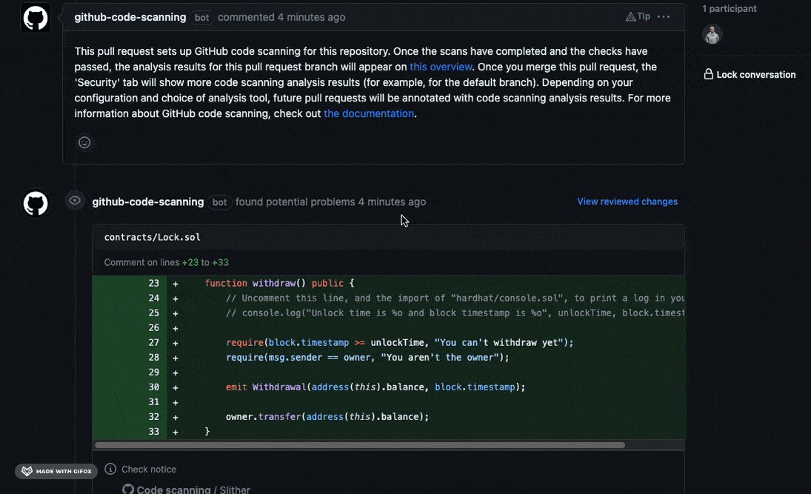

When it comes to developing [smart contracts](https://ethereum.org/en/smart-contracts/) on the EVM blockchains, having a reliable and efficient development environment is crucial. One popular option among developers is Hardhat, a powerful development framework that simplifies the process of building, testing, and deploying smart contracts. 

In this blog post, we will discuss the steps to set up a complete and fully operational repository for solidity smart contract development using hardhat, biome, solhint, husky and configuring a CI on GitHub with slither.

## Prerequisites

- [Node](https://nodejs.org/en)
- [yarn](https://yarnpkg.com/getting-started) or [npm](https://docs.npmjs.com/cli/v8): in this article I’ll use yarn
- GitHub
- [Hardhat for Visual Studio Code](https://hardhat.org/hardhat-vscode/docs/overview#hardhat-for-visual-studio-code)

## Step 1: Setting up initial project

1. First of all, we need to initialise the project inside your chosen location by running:

```bash
yarn init -y
```

it will create a package.json file.

2. Install hardhat by running the command:

```bash
yarn add --dev hardhat
```

it will install hardhat package as dev dependency. 

3. Create the project by running command:

```bash
npx hardhat init
```

4. Select the project type to create:
```bash
888    888                      888 888               888
888    888                      888 888               888
888    888                      888 888               888
8888888888  8888b.  888d888 .d88888 88888b.   8888b.  888888
888    888     "88b 888P"  d88" 888 888 "88b     "88b 888
888    888 .d888888 888    888  888 888  888 .d888888 888
888    888 888  888 888    Y88b 888 888  888 888  888 Y88b.
888    888 "Y888888 888     "Y88888 888  888 "Y888888  "Y888

👷 Welcome to Hardhat v2.18.0 👷‍

? What do you want to do? … 
  Create a JavaScript project
❯ Create a TypeScript project
  Create an empty hardhat.config.js
  Quit
```

I will be using *TypeScript* so select *Create a TypeScript project* and follow the instruction.

It should create the following structure:

- `contracts/` is where the source files for your contracts should be.
- `test/` is where your tests should go.
- `scripts/` is where simple automation scripts go.
- `hardhat.config.js` is where hardhat configurations and helper functions go.

If you need to change these paths, take a look at the [paths configuration section](https://hardhat.org/hardhat-runner/docs/config#path-configuration).

I also prefer to customise `yarn` commands in `package.json` file by adding the scripts section in this way:

```json
"scripts": {
    "clean": "npx hardhat clean",
    "test": "npx hardhat test",
    "chain": "npx hardhat node",
    "coverage": "npx hardhat coverage",
    "lint": "yarn dlx @biomejs/biome check . & solhint 'contracts/**/*.sol'",
    "lint:fix": "yarn dlx @biomejs/biome format . --write & solhint contracts/**/*.sol --fix & prettier --write contracts/**/*.sol",
    "compile": "npx hardhat compile",
    "deploy:local": "npx hardhat run --network localhost scripts/deploy.ts",
    "deploy:sepolia": "npx hardhat run --network sepolia scripts/deploy.ts",
    "prepare": "husky install",
    "postinstall": "husky install",
    "prepack": "pinst --disable",
    "postpack": "pinst --enable"
  },
```

## Step 2: Adding lint and hooks

We are gonna use two main lint packages:

- [biome](https://biomejs.dev/): for formatting and linting TypeScript code
- [solhint](https://github.com/protofire/solhint): for formatting and linting Solidity code with [hardhat plugin](https://hardhat.org/hardhat-runner/plugins/nomiclabs-hardhat-solhint).

and for setting up pre-commit or pre-push hooks we will use [husky](https://typicode.github.io/husky/getting-started.html).

### Biome

1. To install Biome, we need to run the following commands in a directory containing a `package.json` file:

```shell
yarn add --dev --exact @biomejs/biome
```

2. To create the configuration, run the `init` command in the root folder of your project:

```bash
yarn dlx @biomejs/biome init
```

It will create a `biome.json` file with some default lint configurations. 

3. We need to ignore `typechain-types` files in `biome.json` like this:

```json
{
    "$schema": "https://biomejs.dev/schemas/1.2.2/schema.json",
    "organizeImports": {
       "enabled": true
    },
    "linter": {
       "enabled": true,
       "rules": {
        "recommended": true
       }
    },
    "files": {
       "ignore": ["./typechain-types"]
    }
}
```

Now we can run the following commands:

```bash
# lint any file 
yarn dlx @biomejs/biome check .
# format any file
yarn dlx @biomejs/biome format . --write
```

### Solhint

1. Make sure to have [solhint](https://github.com/protofire/solhint) installed globally
2. Install [hardhat-solhint](https://hardhat.org/hardhat-runner/plugins/nomiclabs-hardhat-solhint) package:
```bash
yarn add --dev @nomiclabs/hardhat-solhint
```
3. And add the following statement to your `hardhat.config.js`:

```bash
 import "@nomiclabs/hardhat-solhint";
```
4. Add solhint configuration file:

```bash
solhint --init
```

Now you can run following commands to lint:

```bash
npx hardhat check
# or
solhint 'contracts/**/*.sol'
```

Or if you configured the package.json with custom commands, you can just run:

```bash
# checking .ts and .sol files
yarn run lint
# formatting .ts and .sol files
yarn run lint:fix
```
### Husky

> You can use it to **lint your commit messages**, **run tests**, **lint code**, etc... when you commit or push. Husky supports **[all client-side Git hooks](https://git-scm.com/docs/githooks)**.

Install husky in the project

```bash
yarn dlx husky-init --yarn2 && yarn
```

It will:

- Add `prepare` script to `package.json`
- Create a sample `pre-commit` hook that you can edit (by default, `npm test` will run when you commit)
- Configure Git hooks path

I prefer running tests and lint on push, to do that I will add a new config by running the command:

```bash
npx husky add .husky/pre-push
```

and add following content to created file:

```bash
#!/usr/bin/env sh
. "$(dirname -- "$0")/_/husky.sh"

echo "🕺 Permorming linting checks..."
yarn lint
echo "Your code is beatiful, nice job 👍"

echo "🧪 Testing your ugly code..."
yarn test
echo "All tests passed 🚀"
```
Now every time we push to the repository we will run lint and tests automatically.

## Step 3: Hardhat configuration

In this step we need to enhance hardhat with some more configurations for supported chains.

1. Create a .env file in the project directory with folowing content:

```env
# Get your api key from: https://etherscan.io/
ETHERSCAN_API_KEY=<your-etherscan-api-key>
# Get your api key from: https://www.alchemy.com/pricing
SEPOLIA_URL=https://eth-sepolia.alchemyapi.io/v2/<alchemy key>
# export from wallet
PRIVATE_KEY=<your-account-private-key>
# for gas extimation in unit tests
REPORT_GAS=true
# Get your api key from: https://coinmarketcap.com/api/
REPORT_GAS_COIN_MARKET_CAP_KEY=<your-account-key>
# in order to transfer ownership after deploy
CONTRACTS_OWNER_ADDRESS= <target address>
```

2. Update `hardhat.config.ts` with following content:

```tsx
import "@nomicfoundation/hardhat-toolbox";
import "@nomiclabs/hardhat-solhint";
import { HardhatUserConfig } from "hardhat/config";

const config: HardhatUserConfig = {
    solidity: {
     version: "0.8.19",
     settings: {
      // property of the solidity compiler
      // maximize gas cost savings by taking into consideration how many times the bytecode is expected to run (lifetime)
      // and the cost of introducing an optimization at compile time
      optimizer: {
       enabled: true,
       runs: 200,
      },
     },
    },
    networks: {
     sepolia: {
      url: process.env.SEPOLIA_URL_URL || "",
      accounts:
       process.env.PRIVATE_KEY !== undefined ? [process.env.PRIVATE_KEY] : [],
     },
    },
    gasReporter: {
     enabled: process.env.REPORT_GAS !== undefined,
     coinmarketcap: process.env.REPORT_GAS_COIN_MARKET_CAP_KEY || "",
    },
    etherscan: {
     apiKey: process.env.ETHERSCAN_API_KEY,
    },
};

export default config;
```

Now we should be able (after setting the variables in `.env`) to deploy and verify the contract on sepolia chain:

```bash
# deploy
yarn run deploy:sepolia
# contract verification
npx hardhat verify "<CONTRACT ADDRESS>" --network sepolia
```

## Step 4: Continuous Integration and GitHub

[Continuous integration](https://docs.github.com/en/actions/automating-builds-and-tests/about-continuous-integration) is important for shipping secure, beautiful and reliable code. In this case, we are going to build a CI pipeline with [GitHub Actions](https://docs.github.com/en/actions/learn-github-actions/understanding-github-actions).

This pipeline will:

- Build and test our Solidity code.
- Perform static analysis using [slither](https://github.com/crytic/slither).

> **Slither** is a Solidity static analysis framework written in Python3. It runs a suite of vulnerability detectors, prints visual information about contract details, and provides an API to easily write custom analyses. Slither enables developers to find vulnerabilities, enhance their code comprehension, and quickly prototype custom analyses.

To begin lets create a new folder in our project called `.github`, then another one called `workflows` and create a new file inside `workflow` folder called `ci.yml`. 

Here the content of `ci.yml`:

```yaml
name: Continuous Integration
on:
  push: # run on every push
    branches: [ main ]
  pull_request: # run on every pull request

jobs:
  build-n-test: # building smart contract, running lint and tests
    runs-on: ubuntu-latest
    steps:
      - uses: actions/checkout@v2

      - name: Install dependencies
        run: yarn install

      - name: Compile smart contract
        run: yarn compile

      - name: Run linting checks
        run: yarn lint

      - name: Run tests
        run: yarn test
  
  code-analysis: # static code analysis
    runs-on: ubuntu-latest
    permissions:
      # required for uploading slither sarif results
      security-events: write
    steps:
      - uses: actions/checkout@v2

      - name: Run static analysis with slither
        uses: crytic/slither-action@v0.3.0
        id: slither
        continue-on-error: true
        with:
          sarif: results.sarif
          slither-args: --filter-paths node_modules # exclude other contracts (open zeppelin ones)

      - name: Upload static anaylisis SARIF output file # it should also add relevant comments on PR
        uses: github/codeql-action/upload-sarif@v2
        with:
          sarif_file: ${{ steps.slither.outputs.sarif }}
```

This pipeline will be triggered by a pull requests and will run in parallel `build-n-test` and `code analysis` jobs. 
Slither’s result will be [exported](https://docs.github.com/en/code-security/code-scanning/integrating-with-code-scanning/uploading-a-sarif-file-to-github) to the Security tab of the Github project and some comments will be added to the PR, for example:


> It will work only when Code scanning feature is available (so the repo need to be public), in alternative you could use [Markdown report](https://github.com/marketplace/actions/slither-action#example-workflow-markdown-report) workflow.

In order to keep everything up to date, I also suggest to create a `dependabot.yml` file in `.github` folder with following content:

```yaml
version: 2
updates:
  - package-ecosystem: "npm" 
    directory: "/" # Location of package manifests
    schedule:
      interval: "daily"
  - package-ecosystem: "github-actions"
    directory: "/"
    schedule:
      interval: "daily"
```

## Conclusion

Setting up a Hardhat repository for Solidity smart contract development is a straightforward process that provides you with a robust environment to build, test, and deploy your contracts. By following the steps outlined in this blog post, you can quickly get started with your blockchain development journey and leverage the power of Hardhat along with other tools to develop secure and reliable smart contracts on EVM blockchains.

You can find the complete source code, or use it as a template, in the GitHub repository: https://github.com/olich97/solidity-hardhat-template